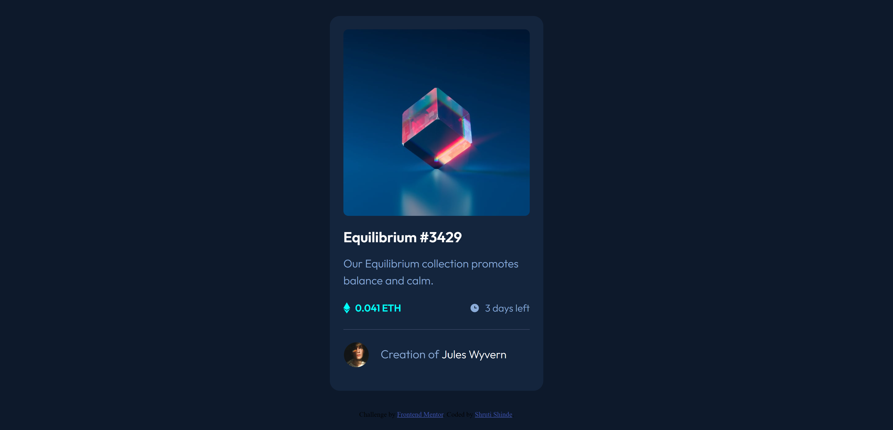

# Frontend Mentor - NFT preview card component solution

This is a solution to the [NFT preview card component challenge on Frontend Mentor](https://www.frontendmentor.io/challenges/nft-preview-card-component-SbdUL_w0U). Frontend Mentor challenges help you improve your coding skills by building realistic projects. 

## Table of contents

- [Overview](#overview)
  - [The challenge](#the-challenge)
  - [Screenshot](#screenshot)
  - [Links](#links)
- [My process](#my-process)
  - [Built with](#built-with)
  - [What I learned](#what-i-learned)
  - [Continued development](#continued-development)
- [Author](#author)


## Overview

### The challenge

Users should be able to:

- View the optimal layout depending on their device's screen size
- See hover states for interactive elements

### Screenshot



### Links

- Solution URL: [https://github.com/ShrutiShinde418/FrontendMentor/tree/main/nft-preview-card-component-main](https://github.com/ShrutiShinde418/FrontendMentor/tree/main/nft-preview-card-component-main)
- Live Site URL: [https://frontend-mentor-7rj3nmeqz-shrutishinde418.vercel.app/](https://frontend-mentor-7rj3nmeqz-shrutishinde418.vercel.app/)

## My process

### Built with

- Semantic HTML5 markup
- CSS variables
- Flexbox
- CSS Grid

### What I learned

- CSS Grid

```css
.author {
  display: grid;
  grid-template-columns: 1fr 4fr;
}
```

### Continued development

- CSS Grid

## Author

- Frontend Mentor - [@ShrutiShinde418](https://www.frontendmentor.io/profile/ShrutiShinde418)

