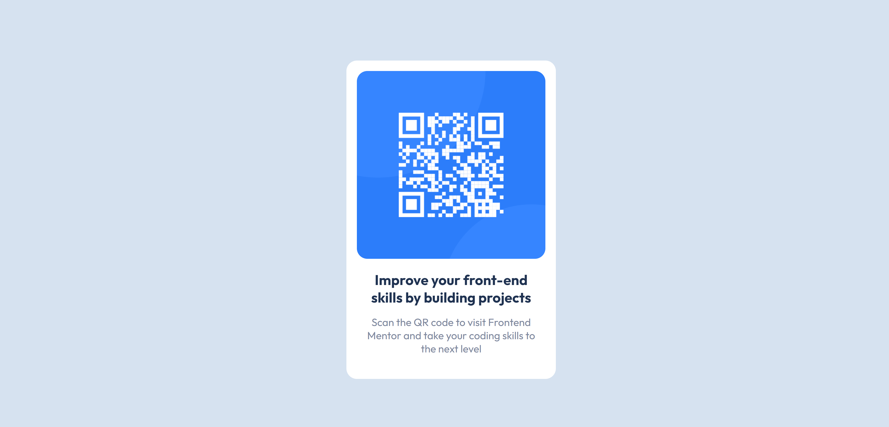

# Frontend Mentor - QR code component solution

This is a solution to the [QR code component challenge on Frontend Mentor](https://www.frontendmentor.io/challenges/qr-code-component-iux_sIO_H). Frontend Mentor challenges help you improve your coding skills by building realistic projects.

## Table of contents

- [Overview](#overview)
  - [Screenshot](#screenshot)
  - [Links](#links)
- [My process](#my-process)
  - [Built with](#built-with)
  - [Useful resources](#useful-resources)
- [Author](#author)

## Overview

### Screenshot

### Links

- Solution URL: [https://github.com/ShrutiShinde418/FrontendMentor/tree/main/qr-code-component](https://github.com/ShrutiShinde418/FrontendMentor/tree/main/qr-code-component)
- Live Site URL: [https://qr-code-component-9napp7t9v-shrutishinde418.vercel.app/](https://qr-code-component-9napp7t9v-shrutishinde418.vercel.app/)

## My process

### Built with

- Semantic HTML5 markup
- SASS
- Flexbox

### Useful resources

- [csslayout.io](https://csslayout.io/) - This helped me in getting the basic layout of the card right.

## Author

- Frontend Mentor - [@ShrutiShinde418](https://www.frontendmentor.io/profile/ShrutiShinde418)
